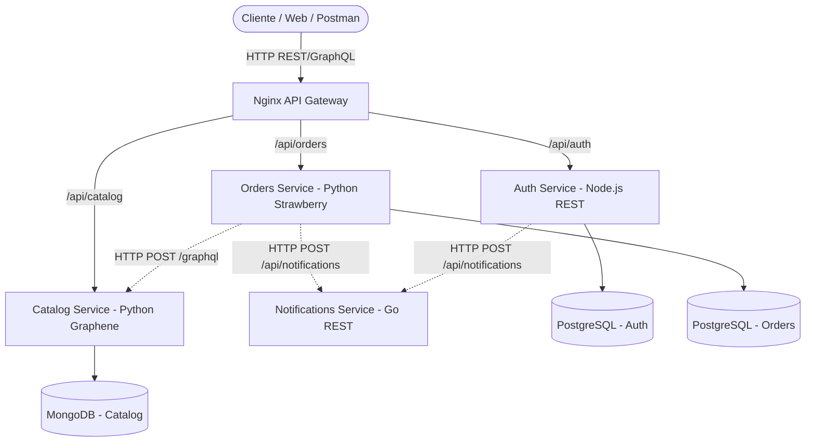

# Diagrama de Arquitectura

El siguiente diagrama muestra la comunicación lógica entre los diferentes microservicios, bases de datos y el API Gateway.

```mermaid
graph TD
    Client([Cliente / Web / Postman]) -->|HTTP REST/GraphQL| Gateway[Nginx API Gateway]
    
    Gateway -->|/api/auth| Auth[Auth Service - Node.js REST]
    Gateway -->|/api/catalog| Catalog[Catalog Service - Python Graphene]
    Gateway -->|/api/orders| Orders[Orders Service - Python Strawberry]
    
    Orders -.->|HTTP POST /graphql| Catalog
    Orders -.->|HTTP POST /api/notifications| Notifications
    Auth -.->|HTTP POST /api/notifications| Notifications[Notifications Service - Go REST]
    
    Auth --> DB_Auth[(PostgreSQL - Auth)]
    Catalog --> DB_Catalog[(MongoDB - Catalog)]
    Orders --> DB_Orders[(PostgreSQL - Orders)]
```
