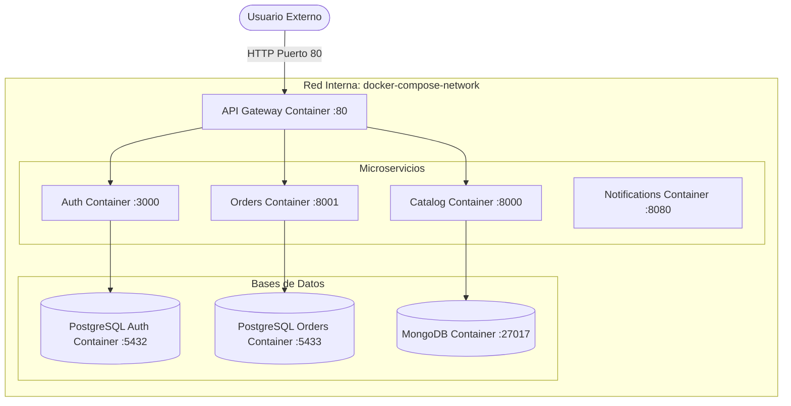

# Diagrama de Despliegue

Este diagrama ilustra cómo se despliegan los contenedores utilizando Docker Compose dentro de la misma red (Bridge) en la máquina anfitriona.

```mermaid
graph TD
    subgraph Docker Network [Red Interna: docker-compose-network]
        Nginx[API Gateway Container :80]
        
        subgraph Microservicios
            Auth[Auth Container :3000]
            Catalog[Catalog Container :8000]
            Orders[Orders Container :8001]
            Notif[Notifications Container :8080]
        end
        
        subgraph Bases de Datos
            PG_Auth[(PostgreSQL Auth Container :5432)]
            PG_Orders[(PostgreSQL Orders Container :5433)]
            Mongo[(MongoDB Container :27017)]
        end
        
        %% Enrutamiento interno del Gateway
        Nginx --> Auth
        Nginx --> Catalog
        Nginx --> Orders
        
        %% Conexiones a bases de datos
        Auth --> PG_Auth
        Catalog --> Mongo
        Orders --> PG_Orders
    end
    
    %% Acceso Externo
    User([Usuario Externo]) -->|HTTP Puerto 80| Nginx
```
